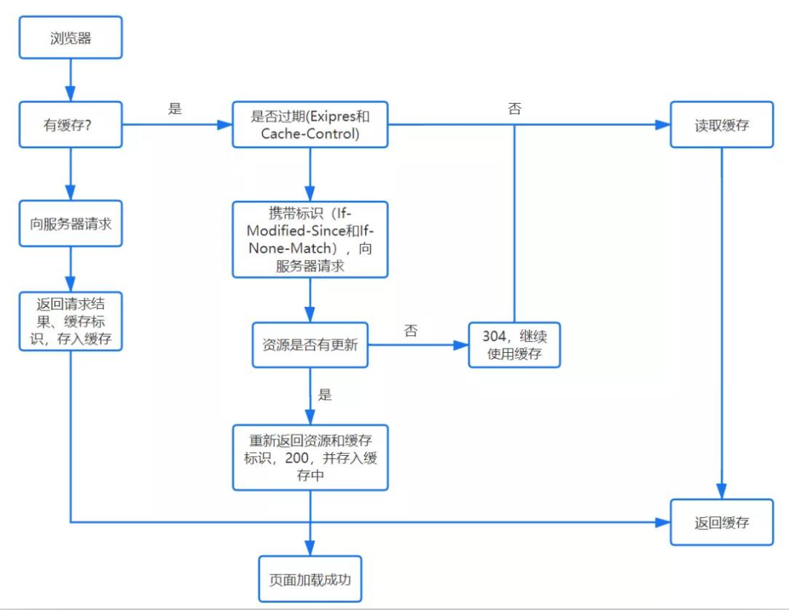
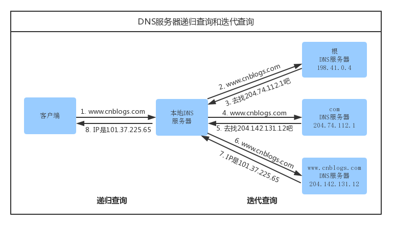
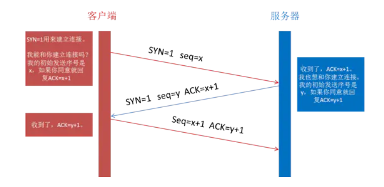
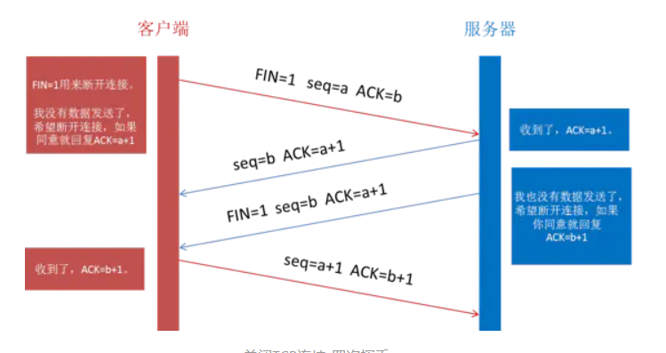
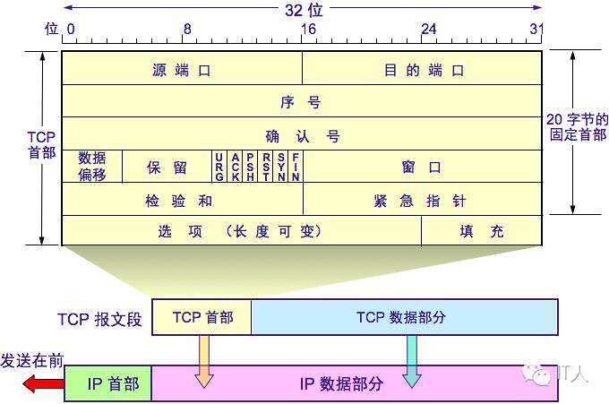
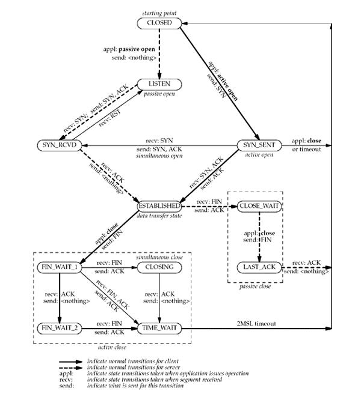

## 浏览器输入 url 后的全过程

1. url 解析
0. DNS 查询
0. TCP 连接
0. HTTP 请求
0. 渲染页面
0. *断开 TCP 连接 

### url 解析

- 地址解析：判断 url 是否合法，完成字符编码等操作
- *HSTS：强制客户端使用 HTTPS 访问页面
- 其他操作：安全检查，访问限制等

- 检查缓存：
    - 无缓存：发起请求。
    - 有缓存：
        - 未过期：读取缓存
        - 发起请求，标识 If-Modified-Since, If-None-Match 
            - 资源无更新：304。继续使用缓存
            - 有更新：200，并返回请求资源。存入缓存中。

### DNS 查询

1. 缓存
    1. 浏览器缓存
    2. 操作系统缓存
    3. 路由器缓存
    4. ISP 缓存
2. 查询
    1. 主机向本地域名服务器查询（递归查询）
    2. 本地域名服务器（迭代查询）
        1. 向根域名服务器查询
        2. 向顶级域名服务器查询
        3. 向二级域名服务器查询
        4. ...

- 域名服务器
    - 根域名服务器（13个 ip）
    - 顶级域名服务器（.com, .net, .org, ...）
    - 二级域名服务器（qq, baidu, 163, ...）
    - 三级域名服务器 (mail, www, ...)
    - ...

- 递归查询：客户端只发一次请求，要求对方给出最终结果
- 迭代查询：客户端发出一次请求，对方如果没有授权回答，它就会返回一个能解答这个查询的其它名称服务器列表，客户端会再向返回的列表中发出请求，直到找到最终负责所查域名的名称服务器，从它得到最终结果

### TCP 连接

- 建立连接：三次握手
    1. 客户端发送syn包(seq=x)给服务器 （进入SYN_SENT状态）
    2. 服务器收到syn包，确认客户的 SYN (ack=x+1)，同时发送自己的syn(seq=y)，即SYN+ACK包（进入SYN_RECV状态）
    3. 客户端收到服务器发送的SYN+ACK包，向服务器发送ACK包 (ack=y+1)。握手完毕，TCP连接建立完成，客户端和服务器进入ESTABLISHED状态。
- 断开连接：四次挥手
    1. 客户端发送FIN，请求断开连接
    2. 服务器返回 ACK
    3. 服务器在数据发送完毕之后，发送 FIN
    4. 客户端返回 ACK

- TCP 报文格式

- TCP 状态转移

### HTTP 连接

### 页面渲染